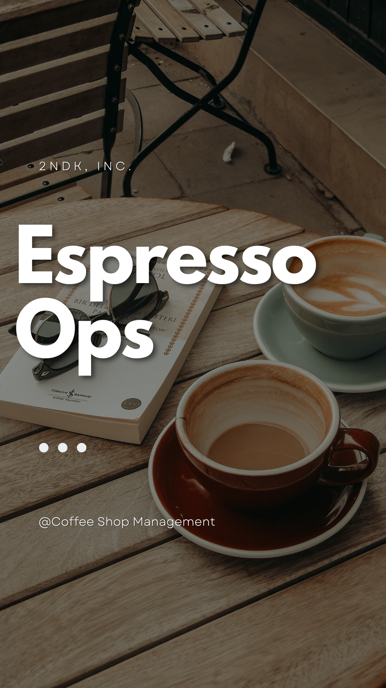

# EspressoOps

**EspressoOps** là hệ thống quản lý bán hàng (POS) dành cho quán cà phê, được xây dựng bằng **C# WinForms** theo kiến trúc 3 lớp (**GUI - BUS - DAL**), sử dụng **.NET 8.0** và tích hợp cơ sở dữ liệu **SQL Server**. Dự án cung cấp một giải pháp toàn diện để quản lý đơn hàng, sản phẩm, nhân viên và báo cáo cho các quán cà phê.

---

## 📖 Giới thiệu

EspressoOps được thiết kế để tối ưu hóa quy trình vận hành quán cà phê với giao diện thân thiện, tính năng mạnh mẽ và dễ dàng triển khai. Hệ thống hỗ trợ từ việc đặt hàng nhanh chóng tại quầy thu ngân đến quản lý thông tin khách hàng, sản phẩm, và tạo báo cáo doanh thu cơ bản.

Dự án được phát triển với mục tiêu học tập và ứng dụng thực tế, phù hợp cho các quán cà phê quy mô nhỏ đến trung bình.

---

## 📁 Cấu trúc dự án

```
EspressoOps/
│
├── csms/                     # Ứng dụng chính
│   ├── assets/               # Tài nguyên giao diện: logo, icon
│   ├── BUS/                  # Business Logic Layer (BUS)
│   ├── DAL/                  # Data Access Layer (DAL)
│   ├── DTO/                  # Data Transfer Objects (DTO)
│   ├── GUI/                  # Giao diện người dùng WinForms
│   ├── Product_Directory/    # Ảnh minh họa sản phẩm
│   ├── User_Directory/       # Ảnh đại diện người dùng
│   ├── csms.sln             # Solution file
│
├── database/
│   └── EspressoOps.sql       # Cấu trúc và dữ liệu mẫu của cơ sở dữ liệu
│
├── LICENSE                   # Thông tin bản quyền
└── README.md                 # Tài liệu hướng dẫn
```

---

## ⚙️ Tính năng chính

- **Đăng nhập/Đăng ký nhân viên**: Hỗ trợ phân quyền cho quản lý và nhân viên.
- **Quản lý đơn hàng**: Tạo, chỉnh sửa, và hoàn thành đơn hàng tại quầy thu ngân.
- **Quản lý sản phẩm**: Thêm, sửa, xóa sản phẩm (đồ uống, đồ ăn nhẹ, v.v.).
- **Quản lý thành viên**: Theo dõi thông tin khách hàng thân thiết và áp dụng ưu đãi.
- **Quản lý giảm giá**: Tạo chương trình khuyến mãi và áp dụng tự động.
- **Quản lý thông tin nhân viên**: Theo dõi hồ sơ và lịch sử hoạt động của nhân viên.
- **In hóa đơn**: Tạo hóa đơn chi tiết cho khách hàng.
- **Báo cáo cơ bản**: Thống kê doanh thu, sản phẩm bán chạy, và hiệu suất nhân viên.

---

## 🚀 Cài đặt

### Yêu cầu hệ thống

- **Hệ điều hành**: Windows 10 hoặc cao hơn (64-bit).
- **.NET SDK**: Phiên bản 8.0 hoặc mới hơn ([Tải về](https://dotnet.microsoft.com/en-us/download/dotnet/8.0)).
- **Cơ sở dữ liệu**: SQL Server Express 2019 hoặc tương thích ([Tải về](https://www.microsoft.com/en-us/sql-server/sql-server-downloads)).
- **IDE**: Visual Studio 2022 (Community, Professional hoặc Enterprise).
- **Bộ nhớ**: Tối thiểu 4GB RAM (khuyến nghị 8GB).
- **Dung lượng ổ đĩa**: Khoảng 500MB cho dự án và cơ sở dữ liệu.

### Thao tác cài đặt

1. **Clone dự án**:
   ```bash
   git clone https://github.com/your-username/EspressoOps.git
   cd EspressoOps
   ```

2. **Khởi tạo cơ sở dữ liệu**:
   - Mở **SQL Server Management Studio (SSMS)**.
   - Mở file `database/EspressoOps.sql` và chạy script để tạo cơ sở dữ liệu và dữ liệu mẫu.

3. **Chỉnh sửa chuỗi kết nối**:
   - Mở file `csms/DAL/Connection.cs`.
   - Sửa `connectionString` để phù hợp với cấu hình SQL Server của bạn:
     ```csharp
     private static string connectionString = "Data Source=.;Initial Catalog=EspressoOps;Integrated Security=True";
     ```
   - Nếu sử dụng SQL Server với tài khoản riêng, thay bằng:
     ```csharp
     private static string connectionString = "Data Source=YOUR_SERVER_NAME;Initial Catalog=EspressoOps;User Id=YOUR_USERNAME;Password=YOUR_PASSWORD;";
     ```

4. **Chạy dự án**:
   - Mở file `csms.sln` bằng **Visual Studio 2022**.
   - Đặt dự án `csms` làm **Startup Project**.
   - Nhấn **F5** hoặc nút **Start** để chạy ứng dụng.

5. **Đăng nhập thử**:
   - Sử dụng tài khoản mặc định (nếu có trong dữ liệu mẫu):
     - Tên đăng nhập: `admin`
     - Mật khẩu: `password123`

---

## 🧱 Kiến trúc

Dự án được xây dựng theo **kiến trúc 3 lớp** để đảm bảo tính mô-đun, dễ bảo trì và mở rộng:

1. **DTO (Data Transfer Object)**:
   - Định nghĩa các model dữ liệu trung gian (ví dụ: `ProductDTO`, `OrderDTO`).
   - Dùng để truyền dữ liệu giữa các tầng mà không phụ thuộc trực tiếp vào cơ sở dữ liệu.

2. **DAL (Data Access Layer)**:
   - Chứa các lớp tương tác trực tiếp với cơ sở dữ liệu (SQL Server).
   - Sử dụng ADO.NET hoặc Entity Framework (tùy cấu hình) để thực hiện truy vấn.
   - Ví dụ: `ProductDAL` xử lý CRUD cho bảng sản phẩm.

3. **BUS (Business Logic Layer)**:
   - Chứa logic nghiệp vụ của ứng dụng.
   - Kết nối giữa GUI và DAL, xử lý các quy tắc kinh doanh (ví dụ: tính toán giảm giá, kiểm tra tồn kho).
   - Ví dụ: `OrderBUS` quản lý quy trình đặt hàng.

4. **GUI (Presentation Layer)**:
   - Giao diện người dùng được xây dựng bằng **WinForms**.
   - Bao gồm các form như đăng nhập, quản lý đơn hàng, báo cáo, v.v.
   - Được thiết kế tối ưu cho trải nghiệm người dùng tại quầy thu ngân.

---

## 📷 Giao diện mẫu



---

## 🛠️ Hướng dẫn phát triển

### Thêm tính năng mới

1. Tạo **DTO** mới trong thư mục `DTO` nếu cần model dữ liệu mới.
2. Thêm phương thức truy vấn trong `DAL` để tương tác với cơ sở dữ liệu.
3. Cập nhật logic nghiệp vụ trong `BUS`.
4. Thiết kế giao diện trong `GUI` bằng **WinForms Designer** hoặc code trực tiếp.

### Debug

- Sử dụng **Visual Studio Debugger** để kiểm tra lỗi.
- Kiểm tra log trong `Debug` hoặc file log (nếu được cấu hình).
- Đảm bảo cơ sở dữ liệu đã được khởi tạo đúng trước khi chạy.

### Tùy chỉnh giao diện

- Thay đổi logo/icon trong thư mục `assets`.
- Cập nhật ảnh sản phẩm trong `Product_Directory`.
- Chỉnh sửa giao diện form trong **WinForms Designer**.

---

## 📜 Giấy phép

Dự án được phát hành dưới giấy phép [MIT License](LICENSE). Xem chi tiết trong file `LICENSE`.

---

## 👨‍💻 Đóng góp

1. Fork dự án.
2. Tạo branch mới:
   ```bash
   git checkout -b feature/your-feature-name
   ```
3. Commit thay đổi:
   ```bash
   git commit -m "Add your feature description"
   ```
4. Push lên branch:
   ```bash
   git push origin feature/your-feature-name
   ```
5. Tạo Pull Request trên GitHub.

---

## 🙏 Tác giả

Dự án được phát triển bởi **DatDev** với mục tiêu học tập và triển khai hệ thống POS cho cửa hàng cà phê. Nếu bạn có thắc mắc hoặc cần hỗ trợ, vui lòng liên hệ qua GitHub Issues.

---

## ✅ Ghi chú

- Đảm bảo cài đặt đầy đủ **.NET SDK 8.0** và **SQL Server** trước khi chạy.
- Dự án phù hợp cho môi trường Windows; để triển khai trên macOS/Linux, cần sử dụng ASP.NET hoặc chuyển sang .NET MAUI.
- Dữ liệu mẫu trong `EspressoOps.sql` chỉ mang tính minh họa, bạn cần tùy chỉnh theo nhu cầu thực tế.